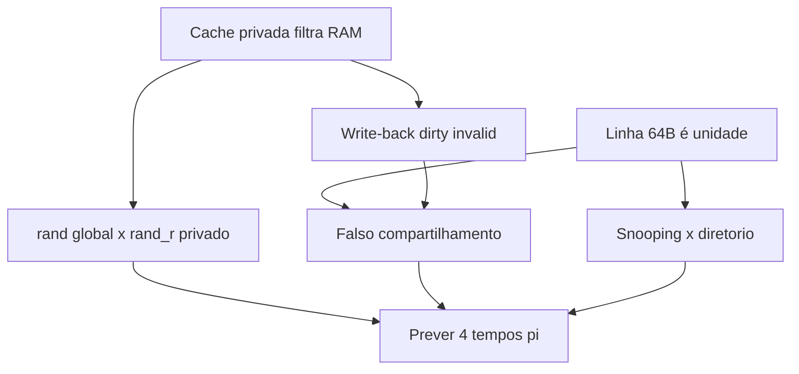

> [!quote] YOU

Quero instalar globalmente essa ferramenta, eu sei que tem uma skill do matt poccock instalda referente a teach. renomei para teach-matt. git clone https://github.com/amosblomqvist/learn .pi

> [!abstract] PI

Error: Request was aborted

> [!quote] YOU

Quero instalar globalmente essa ferramenta, eu sei que tem uma skill do matt poccock instalda referente a teach. renomei para teach-matt. Ver: https://github.com/amosblomqvist/learn

> [!quote] YOU

Ajuste o modelo dos subagents para ser  opencode/muse-spark-1.3-contributor-free

> [!abstract] PI

Pronto!

**1. teach do Matt Pocock renomeado:**
- `/home/eugenio/.agents/skills/teach` → `teach-matt`
- `SKILL.md`: `name: teach-matt`
- symlink `~/.pi/agent/skills/teach-matt` atualizado

**2. learn instalado globalmente:**
- `pi install https://github.com/amosblomqvist/learn`
- pacote em `~/.pi/agent/git/github.com/amosblomqvist/learn`
- skills `teach` (Amos) + `visualize` e extensions `quiz`, `md-log`, `visual-tools`, `ask-user-question` carregadas via package (ask-user-question já era idêntico, mantido)
- `npm install` no `visual-tools` feito

**3. Agents globais:**
- copiados para `~/.pi/agent/agents/`: `researcher`, `mermaid-maker`, `svg-maker` (do learn) + `scout`, `worker` (do pi-interactive-subagents, para sobreviver a updates)

**4. Modelos ajustados:**
Todos os 5 subagents agora em `opencode/muse-spark-1.3-contributor-free` (verificado via `subagents_list`):
researcher, scout, worker, mermaid-maker, svg-maker

Pendente opcional: `visual-tools` precisa de system deps para render — `rsvg-convert` (librsvg2-bin) e Chrome/Chromium para mermaid-cli. Quer que eu instale via apt?

> [!quote] YOU

sim

> [!abstract] PI

Instalação global concluída:

- `teach` do Matt Pocock → `teach-matt` (sem colisão)
- `https://github.com/amosblomqvist/learn` instalado como pi package global (skills `teach` + `visualize`, extensions `quiz`, `md-log`, `visual-tools`)
- Agents em `~/.pi/agent/agents/`: researcher, scout, worker, mermaid-maker, svg-maker — todos com `model: opencode/muse-spark-1.3-contributor-free`
- Render testado: mermaid via Chrome do puppeteer cache OK, SVG via `~/.local/bin/rsvg-convert` 2.58.0 OK (sem sudo)

Reinicie o pi ou rode `/reload` para carregar as novas extensions/skills na sessão atual.

> [!quote] YOU

Não posso apagar a skill teach-2?

> [!abstract] PI

Pode apagar sim — ela é redundante e inclusive está incompleta.

O que eu vi aqui:

- `~/.agents/skills/teach-2/` só tem o `SKILL.md` (de 02/09), com `name: teach-2` e descrição *"Alternate teach skill — same structured methodology as teach..."*. Ou seja, é uma cópia alternativa do teach do Matt Pocock.
- `~/.agents/skills/teach-matt/` é o original completo: tem `SKILL.md` + `GLOSSARY-FORMAT.md`, `MISSION-FORMAT.md`, `RESOURCES-FORMAT.md`, etc. + pasta `agents/`.
- O `teach-2/SKILL.md` referencia `./MISSION-FORMAT.md`, `./RESOURCES-FORMAT.md` e etc., mas esses arquivos não existem na pasta dele — então ele está quebrado/órfão.
- O teach do Amos (do `learn`) agora vem via pi package global, sem conflito de nome.

Então pode remover sem perder nada:

```bash
rm -rf ~/.agents/skills/teach-2
```

Quer que eu apague pra você?

> [!quote] YOU

sim

> [!abstract] PI

Pronto, `teach-2` apagada.

Ficou só:
- `teach-matt` (Matt Pocock, workspace-based)
- `teach` + `visualize` do Amos (via package `learn` global)

Rode `/reload` no pi pra atualizar a lista de skills.

> [!quote] YOU

> [!note] SKILL loaded: teach

Me explique sobre • Variáveis compartilhadas:
• Vantagens para somente leitura ou escrita infrequente (evita 
copias com private e firstprivate)
Tarefa 8:
Implemente estimativa estocástica de π 
usando rand()para gerar os pontos. 
Cada thread deve usar uma variável 
privada para contar os acertos e 
acumular o total em uma variável global 
com #pragma omp critical. 
Depois, implemente uma segunda versão 
em que cada thread escreve seus 
acertos em uma posição distinta de um 
vetor compartilhado. A acumulação deve 
ser feita em um laço serial após a região 
paralela. Compare o tempo de execução 
das duas versões. Em seguida, substitua 
rand()por rand_r()em ambas e 
compare novamente. Explique o 
comportamento dos quatro programas 
com base na coerência de cache e nos 
efeitos do falso compartilhamento.
• Desvantagens para escrita frequente: condição de corrida ou 
serialização devido a sincronização
• Coerência de cache com caches privadas
• Write-through vs. Write-back
• Bit de sujo (Dirty bit)
• Bit de inválido (Invalid bit) em múltiplas caches
• Protocolos de coerência de cache
• Snooping
• Baseados em diretórios
• Variáveis compartilhadas: escrita frequente torna cache inútil e 
deteriora ainda mais o acesso a memória (dois acessos)
• Falso compartilhamento: torna a cache inútil mesmo sem 
compartilhamento de variáveis

> [!question] Quiz
> Em OpenMP, duas threads incrementam a mesma variável compartilhada `total++` sem nenhuma sincronização. O que acontece?
>
> 1. Todos os incrementos são sempre somados
> 2. Alguns incrementos podem ser perdidos
> 3. Cada thread soma em cópia separada
> 4. O programa sempre trava com erro

> [!success] Quiz — correct ✓
> Your answer: 2. Alguns incrementos podem ser perdidos
> Correct answer: 2
>
> Sem sincronização há condição de corrida: ler-modificar-escrever intercalado perde atualizações.

> [!question] Quiz
> Dois elementos vizinhos de um vetor `int hits[N]` são escritos por threads diferentes. Nenhuma thread lê o elemento da outra. O que o hardware de cache faz?
>
> 1. A linha de cache fica pingando entre caches
> 2. Os núcleos escrevem direto na RAM
> 3. Cada cache mantém sua cópia isolada
> 4. As escritas se fundem sem custo

> [!success] Quiz — correct ✓
> Your answer: 1. A linha de cache fica pingando entre caches
> Correct answer: 1
>
> É falso compartilhamento: mesma linha de cache invalidada a cada escrita, mesmo sem compartilhar variável.

> [!question] Question
> Qual é teu objetivo concreto com esse tópico?
>
> Isso muda o que priorizo: implementar a Tarefa 8, passar numa prova teórica, ou os dois.
>
> 1. Implementar a Tarefa 8 e comparar tempos (Recommended)
> 2. Entender a teoria para prova
> 3. Os dois, teoria guiando a implementação

> [!example] Answer
> 3. Os dois, teoria guiando a implementação

> [!question] Quiz
> Sobre write-through vs write-back com caches privadas, qual afirmação é verdadeira?
>
> 1. Ambos só escrevem na evicção da linha
> 2. Nenhum usa bit de sujo na linha
> 3. Write-through propaga cada escrita à memória
> 4. Write-back propaga cada escrita à memória

> [!success] Quiz — correct ✓
> Your answer: 3. Write-through propaga cada escrita à memória
> Correct answer: 3
>
> Write-through escreve junto na memória a cada store. Write-back marca dirty e adia até evicção ou coerência pedir.

> [!question] Quiz
> Quatro threads rodam Monte Carlo com `rand()` dentro de `#pragma omp critical`. Onde está o gargalo principal?
>
> 1. Estado global oculto do rand serializa tudo
> 2. Cada thread gera sequência independente rápida
> 3. O laço serial após a região paralela
> 4. O `critical` só protege a soma final

> [!success] Quiz — correct ✓
> Your answer: 1. Estado global oculto do rand serializa tudo
> Correct answer: 1
>
> `rand()` usa estado interno global. Mesmo com critical só na soma, se o rand também está no critical tudo serializa; se fora, há data race e sequência corrompida.

> [!question] Quiz
> Cada thread acumula em `hits[tid]` onde `hits` é `int hits[8]` compartilhado, com escrita intensa. Por que pode continuar lento mesmo sem condição de corrida?
>
> 1. Cache privada duplica o vetor inteiro
> 2. Vetor compartilhado impede leitura paralela
> 3. Elementos vizinhos dividem a mesma linha
> 4. Write-back desliga com vetor compartilhado

> [!success] Quiz — correct ✓
> Your answer: 3. Elementos vizinhos dividem a mesma linha
> Correct answer: 3
>
> Falso compartilhamento: `hits[0..7]` cabem em 1-2 linhas de 64B. Escritas de threads distintas invalidam a linha no protocolo MESI mesmo sem compartilhar dado.

> [!question] Quiz
> Com protocolo MESI, o núcleo 0 tem o endereço X em estado Exclusive na sua cache. O núcleo 1 escreve em X. O que acontece com a cópia do núcleo 0?
>
> 1. Passa a Shared com valor novo
> 2. Permanece Exclusive sem mudança
> 3. Passa a Dirty e mantém valor
> 4. Passa a Invalid e refaz leitura

> [!success] Quiz — correct ✓
> Your answer: 4. Passa a Invalid e refaz leitura
> Correct answer: 4
>
> Escrita remota invalida as outras cópias. O bit de inválido marca a linha como sem valor usável, forçando novo fetch coerente.

> [!question] Quiz
> `int hits[8]` com 8 threads, cada uma escreve só em `hits[tid]` intensamente, `int` de 4B e linha de 64B. Qual correção elimina o falso compartilhamento?
>
> 1. Declarar o vetor como volatile
> 2. Afastar cada posição em 64B distintos
> 3. Envolver `hits[tid]++` em critical
> 4. Trocar write-back por write-through

> [!success] Quiz — correct ✓
> Your answer: 2. Afastar cada posição em 64B distintos
> Correct answer: 2
>
> Padding de ~64B por entrada põe cada contador em linha própria. Volatile não muda layout, critical serializa, write-through piora o tráfego.

> [!question] Quiz
> Com 64 núcleos, por que coerência por snooping em barramento deixa de escalar e se troca por diretório?
>
> 1. Diretório difunde cada falta a todos
> 2. Snooping guarda lista de donos exata
> 3. Snooping difunde cada falta a todos
> 4. Diretório elimina caches privadas

> [!success] Quiz — correct ✓
> Your answer: 3. Snooping difunde cada falta a todos
> Correct answer: 3
>
> Snooping é broadcast: todo miss interrompe todos. Diretório registra quem tem cada linha e unicasta só aos envolvidos.

> [!question] Quiz
> Cada thread usa `rand_r(&seeds[tid])` com `unsigned seeds[8]` contíguo e conta acertos em variável privada. Por que ainda pode escalar mal?
>
> 1. Variável privada gera tráfego coerente
> 2. As seeds vizinhas dividem linhas
> 3. `rand_r` usa estado global oculto
> 4. `rand_r` exige `critical` em volta

> [!success] Quiz — correct ✓
> Your answer: 2. As seeds vizinhas dividem linhas
> Correct answer: 2
>
> O contador é privado, mas as seeds ficam lado a lado na mesma linha. Cada `rand_r` escreve na sua seed e invalida a linha dos vizinhos: falso compartilhamento nas seeds.

> [!abstract] PI

Achei tua fronteira — ela está alta. Vamos ao plano antes de ensinar.

**Onde tu estás:**
- Piso: condição de corrida, write-through vs write-back, MESI Invalid, falso compartilhamento em `hits[tid]`, `rand()` global, snooping broadcast vs diretório, seeds contíguas em `rand_r` — tudo certo de primeira.
- Teto: ainda não quebrou. Então teu edge não está nos conceitos, está em *prever e medir* os 4 tempos da Tarefa 8 e explicar por coerência. Vou mirar aí, sem repassar o básico.

**Abordagem:**
Do fundamento incondicional para o derivado, na ordem em que o hardware obriga. Primeiro travamos as 2 verdades que todo resto deriva: núcleos só veem memória via cache privada, e a unidade de coerência é a linha de 64B — não a variável. Daí derivamos write-back/dirty/invalid, snooping vs diretório, e só então os 4 programas: `rand()` + `critical` por ponto, vetor compartilhado + `rand()`, e os dois com `rand_r()`. A estimativa é sempre $\pi \approx 4 \cdot hits / N$, com:

$$
\pi \approx 4 \times \frac{\text{pontos dentro do círculo}}{\text{pontos totais}}
$$

Expositivo para o que só dá para contar (tamanho de linha, `rand()` ter estado global), socrático para o que dá para deduzir (por que vetor sem padding continua pingando, por que seed contígua ainda trava).

**Mapa de dependências — essa é a ordem de ensino:**



Stress-testei as raízes: se U1 ou U2 fossem falsas, nada do resto faria sentido — mas elas são aceitáveis sem caveat, então são base segura.

Me dá o ok para começar o loop no U1?

> [!quote] YOU

Esta ok, mas antes de partir para o quiz eu queria que fosse sendo apresentados os conceitos para eu ir aprendendo e/ou revisando. Ou seja, sempre uma explicação teórica antes do quiz

> [!abstract] PI

Perfeito — é exatamente assim que vou fazer: teoria curta e motivada primeiro, quiz depois para travar.

Vamos ao **nó U1**.

### U1 — Motivar: por que trazer isso agora?

Tu queres prever por que 4 versões do mesmo Monte Carlo têm tempos tão diferentes. Todas fazem a mesma conta $\pi \approx 4 \cdot hits / N$. Se tempo fosse só conta, seriam iguais. Não são. Então a diferença não está na aritmética — está no *caminho que cada load/store faz até a RAM*. Sem esse chão, todo resto (dirty, invalid, falso compartilhamento) vira mágica.

### U1 — Estabelecer: a verdade incondicional

> **Cada núcleo só enxerga a RAM através das suas caches privadas.**

Sem caveat. Não existe "às vezes lê direto". Todo `hits[tid]++`, todo `seeds[tid]`, todo `total` passa por L1 privada → L2 → LLC → RAM. A cache privada é um filtro obrigatório, não um atalho opcional.

Isso te parece sólido e sem exceção? Se sim, a base está travada.

### U1 — Conectar: por que isso importa já

Se tudo passa pelo filtro privado, o sistema precisa manter a ilusão de **uma única memória** mesmo com N cópias privadas espalhadas. Essa obrigação é o que cria todo o resto:

- se uma thread escreve muito numa variável compartilhada, o filtro vive invalidando e rebuscando;
- se a política for write-through, cada escrita atravessa até a RAM;
- se for write-back, fica suja no filtro até ser expulsa.

Ou seja: U1 é o porquê da coerência existir.

Quando quiseres, partimos para o quiz-check rápido de U1, e depois U2 — *a unidade de coerência é a linha de 64B, não a variável*.

> [!quote] YOU

continuar. usar pt-br

> [!question] Quiz
> Em um multicore com caches privadas, para onde vai primeiro um store feito por um núcleo?
>
> 1. Para sua cache privada L1
> 2. Direto para a RAM principal
> 3. Para o registrador do vizinho
> 4. Direto para o disco SSD

> [!success] Quiz — correct ✓
> Your answer: 1. Para sua cache privada L1
> Correct answer: 1
>
> Todo acesso passa primeiro pelo filtro privado L1/L2. A RAM só é atingida depois, via write-through, evicção de linha suja ou miss coerente.

> [!abstract] PI

U1 travado. Vamos ao **nó U2**.

### U2 — Motivar: por que precisamos dele agora?

U1 diz que tudo passa pela cache privada. Mas aí vem o mistério da Tarefa 8: cada thread escreve só em `hits[tid]` — variáveis *diferentes*, sem condição de corrida — e mesmo assim o programa com vetor contíguo fica lento. Se coerência fosse por variável, isso seria impossível. Falta a peça que explica esse custo fantasma.

### U2 — Estabelecer: a verdade incondicional

> **A coerência é controlada por linha de cache de 64B, não por variável.**

Sem exceção. O hardware não sabe o que é `int`, `seed` ou `total`. Ele só conhece blocos de 64 bytes com estado (Modified, Exclusive, Shared, Invalid) e dois bits de controle: sujo e inválido. Se dois dados caem na mesma linha, para o hardware é o mesmo objeto.

Pensa no teu `int hits[8]`: $8 \times 4\text{B} = 32\text{B}$. Cabe em meia linha. Oito threads, oito contadores, uma única linha disputada.

Isso te soa sólido como base?

### U2 — Conectar: como se pendura em U1

- U1 diz *por onde* todo acesso passa (cache privada).
- U2 diz *em que grão* a coerência cobra (linha de 64B).

Juntos eles preveem o falso compartilhamento antes mesmo de medirmos: escritas intensas em posições vizinhas vão invalidar a linha umas das outras, mesmo sem compartilhar nada lógico. É daqui que saem o padding de 64B e a explicação das seeds contíguas do `rand_r`.

No próximo passo faço o quiz-check rápido de U2, e aí entramos em D1 — write-back, bit de sujo e bit de inválido.

> [!quote] YOU

continuar

> [!question] Quiz
> Oito threads incrementam cada uma seu `hits[tid]` em um `int hits[8]` contíguo, sem sincronização entre elas. Por que há tráfego de coerência?
>
> 1. Vizinhos dividem a mesma linha de 64B
> 2. Threads leem o contador das outras
> 3. Cada int ocupa uma linha inteira
> 4. Vetor compartilhado bloqueia a L1

> [!success] Quiz — correct ✓
> Your answer: 1. Vizinhos dividem a mesma linha de 64B
> Correct answer: 1
>
> $8 \times 4B = 32B$ cabem em meia linha. A unidade rastreada é a linha, então escritas em variáveis distintas invalidam a cópia umas das outras.

> [!abstract] PI

U2 travado. Vamos ao **nó D1**.

### D1 — Motivar: por que precisamos dele agora?

Já sabemos *por onde* passa (U1) e *em que grão* cobra (U2). Falta saber *quando* a escrita custa RAM. É isso que decide por que variável compartilhada com escrita frequente "torna a cache inútil e ainda piora o acesso" — como diz teu roteiro — e por que leitura é barata e escrita frequente é cara.

### D1 — Estabelecer: como funciona

Dois projetos possíveis para tratar um store que acertou na cache:

- **Write-through:** escreve junto na cache e na memória a cada store. Simples, mas cada escrita paga o custo cheio até a RAM. Bom só se escrita é rara.
- **Write-back:** escreve só na cache e marca a linha como **suja** com o dirty bit ($dirty = 1$ significa "memória está desatualizada"). A RAM só é atualizada na evicção ou quando outro núcleo pede a linha. Leitura repetida e escrita repetida no mesmo núcleo acertam na cache sem ir à RAM.

E o **bit de inválido** é o outro lado: marca que aquela linha não tem valor usável ($valid = 0$). Quando outro núcleo escreve no mesmo endereço, minha cópia passa a Invalid — o próximo load meu vai sofrer miss e rebuscar.

Resumo em uma frase: dirty adia a ida à RAM, invalid força a volta da RAM (ou de outra cache).

### D1 — Conectar: como se pendura em U1 + U2

- De U1: como tudo passa pela privada, a política define quantas vezes atravessamos até a RAM.
- De U2: como a unidade é a linha, um store suja/invalida 64B inteiros, não 4B.

Daqui sai direto a vantagem de variável compartilhada para leitura ou escrita infrequente (copia com `private`/`firstprivate` evita até esse custo) e a desvantagem para escrita frequente: ou paga condição de corrida sem sincronização, ou serializa com `critical`, ou vive invalidando linha — nos três casos a cache deixa de filtrar.

Próximo: quiz-check de D1, depois D3 — `rand()` global contra `rand_r()` privado.

> [!quote] YOU

o que é eviclçao?

> [!abstract] PI

Boa — palavra feia para ideia simples.

**Evicção é quando a cache precisa expulsar uma linha para abrir espaço para outra.**

Pensa pela necessidade:

1. Tua L1 tem poucas centenas de linhas. O programa acessa milhões de endereços.
2. Num miss, ela precisa trazer a linha nova da RAM. Se o conjunto onde essa linha cabe já está cheio, ela é obrigada a escolher uma vítima e expulsar.
3. Essa expulsão é a evicção.

E aí conecta com D1:

- Se a vítima está limpa ($dirty = 0$), é só descartar — a RAM já tem o mesmo valor.
- Se está suja ($dirty = 1$), precisa escrever de volta na RAM antes de descartar, senão perde a atualização. Esse é o custo adiado do write-back.

Então: evicção é o momento em que o write-back finalmente paga a conta da RAM.

> [!quote] YOU

seguir para o proximo passo

> [!question] Quiz
> Uma linha em write-back está com dirty igual a 1 e precisa ser evictada para dar lugar a outra. O que ocorre?
>
> 1. Descarta direto sem ir à memória
> 2. Marca como inválida nos vizinhos
> 3. Escreve o valor de volta na memória
> 4. Trava o núcleo até o próximo miss

> [!success] Quiz — correct ✓
> Your answer: 3. Escreve o valor de volta na memória
> Correct answer: 3
>
> Dirty igual a 1 significa memória desatualizada. Na evicção o hardware faz writeback antes de descartar.

> [!abstract] PI

D1 travado. Vamos ao **nó D3**.

### D3 — Motivar: por que precisamos dele agora?

Na Tarefa 8 tu geras milhões de pontos $(x, y)$ para testar $x^2 + y^2 \le 1$. O gerador é o coração do tempo. Se ele for global e serializado, nem a melhor estratégia de soma salva. É aqui que os 4 programas começam a se separar.

### D3 — Estabelecer: como funciona

- **`rand()`:** guarda o estado numa variável global oculta dentro da libc. Cada chamada lê, atualiza e escreve esse estado. Com 8 threads, ou dá *data race* (sequência corrompida, $\pi$ errado) ou tu protege com `critical` — e aí só uma thread gera por vez. O gerador vira serial, as outras 7 esperam.
- **`rand_r(unsigned *seed)`:** o estado é o `seed` que *tu* passas. Se cada thread tem sua própria `seed` privada (variável local, não vetor contíguo), cada uma avança sua sequência sem falar com ninguém. Geração vira paralela de verdade.

Detalhe que pega: `unsigned seeds[8]` contíguo parece privado por índice, mas pela U2 as 8 seeds dividem meia linha de 64B. Cada `rand_r` escreve na sua seed e invalida a dos vizinhos — falso compartilhamento nas seeds. O certo é `unsigned seed = base + tid` como variável local privada.

### D3 — Conectar: como se pendura em U1 + U2 + D1

- De U1: `rand()` global obriga todo acesso a passar pela mesma linha na mesma cache — ping-pong garantido.
- De U2: seeds contíguas repetem o problema do `hits[8]`, só que no gerador.
- De D1: cada escrita na seed suja a linha e cada leitura vizinha sofre miss.

Por isso a previsão: `rand()` + `critical` por ponto é o pior caso (gera serial + soma serial). `rand_r()` com seed privada libera a geração e deixa só a soma para otimizar — que é o próximo nó D4.

Próximo: quiz-check de D3, depois D4 — `critical` por ponto contra vetor + redução serial.

> [!quote] YOU

seguir para o próximo

> [!question] Quiz
> Por que trocar `rand()` por `rand_r()` com seed privada destrava o Monte Carlo paralelo?
>
> 1. `rand_r` dispensa contar os acertos
> 2. `rand_r` desliga a coerência de cache
> 3. Cada thread avança sua seed sem trava
> 4. `rand_r` usa estado global mais rápido

> [!success] Quiz — correct ✓
> Your answer: 3. Cada thread avança sua seed sem trava
> Correct answer: 3
>
> `rand()` tem estado global oculto que serializa ou corrompe. `rand_r` com `unsigned seed` local dá estado privado por thread, sem tráfego coerente.

> [!abstract] PI

D3 travado. Vamos ao **nó D4**.

### D4 — Motivar: por que precisamos dele agora?

Geração resolvida com `rand_r()` e seed privada. Falta a soma. É aqui que as duas versões da Tarefa 8 se bifurcam — e onde a maioria erra achando que "vetor compartilhado é sempre melhor que `critical`".

### D4 — Estabelecer: as duas estratégias

**Versão A — `critical` por atualização no total global:**
Cada acerto faz `#pragma omp critical total++`. Isso é $N$ entradas em seção crítica (milhões). Só uma thread por vez soma, as outras esperam. Além da serialização, o `total` pinga de cache em cache a cada incremento: cada thread invalida a linha do `total` nas outras. Cache vira inútil.

**Versão B — contador privado + vetor + redução serial:**
Cada thread conta em variável privada `long local = 0` (fica em registrador/L1, zero tráfego coerente). No fim escreve **uma vez** em `hits[tid]`. Depois da barreira, um laço serial soma `hits[0..P-1]`. Custo coerente: $P$ escritas + $P$ leituras, não $N$.

Pegadinha: se `hits` é `int hits[8]` contíguo, essas $P$ escritas finais ainda dividem linha — mas como é uma escrita por thread no fim, o custo é desprezível perto de $N$ incrementos. Se cada thread escrevesse em `hits[tid]` *a cada ponto*, aí sim o falso compartilhamento voltaria com força total. Por isso o padrão certo é privado durante o laço, vetor só no epílogo — ou com padding de 64B se quiser blindar de vez.

### D4 — Conectar

- De U2: `critical` no `total` disputa a mesma linha; vetor com escrita única quase não disputa.
- De D1: `total` global vive sujo e inválido; `local` privado fica limpo na L1 até o fim.
- De D3: só faz sentido otimizar a soma depois de destravar a geração — `rand()` + `critical` mistura os dois gargalos num só.

Previsão parcial dos 4 tempos (do pior ao melhor): `rand()` + `critical` por ponto > `rand()` + vetor > `rand_r()` + `critical` > `rand_r()` + vetor com local privado.

Próximo: quiz-check de D4, depois D2 — snooping contra diretório — e o fechamento G com os 4 programas.

> [!quote] YOU

seguir para o próximo

> [!question] Quiz
> Com N igual a 10 milhões de pontos e P igual a 8 threads, por que contar em variável privada e somar no fim vence o `critical` a cada acerto?
>
> 1. Troca N travas por P escritas finais
> 2. Vetor compartilhado desliga a cache
> 3. Laço serial final usa 8 núcleos juntos
> 4. Variável privada exige `critical` maior

> [!success] Quiz — correct ✓
> Your answer: 1. Troca N travas por P escritas finais
> Correct answer: 1
>
> `critical` por acerto são milhões de serializações e invalidações do total. Privado mais redução faz o laço sem tráfego e só P escritas seguidas de soma serial curta.

> [!abstract] PI

D4 travado. Vamos ao **nó D2**, o último antes do fechamento.

### D2 — Motivar: por que precisamos dele agora?

Até aqui explicamos *o que* pinga (linha) e *quando* custa RAM (dirty/invalid). Falta *como* os núcleos ficam sabendo que precisam invalidar. Sem isso, "snooping" e "baseado em diretórios" do teu roteiro viram nomes decorados — e eles explicam por que o problema piora com muitos núcleos.

### D2 — Estabelecer: os dois projetos

- **Snooping:** não há registro central. Cada miss ou escrita é difundida no barramento e todas as caches espionam (*snoop*) para ver se têm a linha. Funciona bem com poucos núcleos, mas cada falta interrompe todos — com 64 núcleos, o barramento vira o gargalo. É broadcast sempre.
- **Baseado em diretórios:** há um diretório (junto à LLC ou à memória) que anota quem tem cada linha: "linha X está Shared em P0, P3". Numa escrita, o diretório manda invalidação só por unicast aos donos. Escala porque o custo acompanha o número de compartilhadores, não o de núcleos.

### D2 — Conectar

- De U1: como tudo passa pela privada, algum mecanismo precisa avisar as privadas.
- De U2: como a unidade é a linha, o aviso é por linha — e o falso compartilhamento gera avisos inúteis (invalida quem nem usa aquele byte).
- Para a Tarefa 8 com 8 threads, tu ainda estás no regime onde snooping aguenta, mas o vetor contíguo sem padding já mostra o sintoma que em 64 núcleos inviabiliza snooping: tráfego proporcional a escritas, não a dados realmente compartilhados.

Próximo: quiz-check de D2, depois G — a tabela dos 4 programas com previsão de tempos.

> [!quote] YOU

seguir para o próximo

> [!question] Quiz
> Numa escrita em linha Shared, qual a diferença de tráfego entre snooping e diretório?
>
> 1. Diretório avisa a todos, snooping só aos donos
> 2. Snooping avisa a todos, diretório só aos donos
> 3. Nenhum avisa, a RAM arbitra tudo
> 4. Ambos avisam só ao dono escritor

> [!success] Quiz — correct ✓
> Your answer: 2. Snooping avisa a todos, diretório só aos donos
> Correct answer: 2
>
> Snooping difunde no barramento para todas as caches espionarem. Diretório consulta a lista de sharers e unicasta invalidação só a quem tem a linha.

> [!abstract] PI

D2 travado. Fechamento **G — os 4 programas**.

### G — Motivar: juntar tudo para prever antes de medir

Tu já tens o grafo inteiro. Agora a Tarefa 8 vira dedução, não benchmark cego. Mesma conta $\pi \approx 4 \cdot hits / N$, 4 combinações de gerador + soma.

### G — Estabelecer: a tabela

| # | Gerador | Soma | O que acontece no hardware |
|---|---------|------|----------------------------|
| 1 | `rand()` | `critical` por acerto no `total` global | Pior. Estado global do `rand()` + `total` na mesma história: tudo serializa em $N$ entradas críticas, linha do estado e do total pingando via invalidações. Cache inútil. |
| 2 | `rand()` | vetor `hits[tid]` + laço serial | Melhor que 1 na soma ($P$ escritas + soma serial curta), mas geração continua serial/corrompida pelo estado global. O gargalo muda da soma para o gerador. Se `hits` contíguo e escrito a cada ponto, ainda soma falso compartilhamento. |
| 3 | `rand_r()` seed privada | `critical` por acerto | Geração destrava (cada thread avança sua `seed` local sem trava), mas soma continua $N$ serializações no `total` global com ping-pong. |
| 4 | `rand_r()` seed privada | privado + `hits[tid]` uma vez + laço serial | Melhor. Laço sem tráfego (local em L1), $P$ escritas finais, soma serial de $P$ elementos. Com `unsigned seed` local e `hits` com padding de 64B, zero falso compartilhamento. |

Ordem prevista de tempo: **1 > 2 > 3 > 4**. O salto 1→3 costuma ser maior que 2→4, porque destravar a geração elimina serialização de $N$ pontos, não só da soma.

Dois detalhes que tua banca ama:

- **Escrita frequente torna a cache inútil e custa dois acessos:** num miss de leitura numa linha suja em cache remota, precisa 1) escrever a linha suja de volta e 2) buscar para o solicitante. É o "deteriora ainda mais".
- **Vetor sem padding vs com padding:** `int hits[8]` = 32B numa linha. Escrever a cada iteração = ping-pong a cada iteração. Escrever uma vez no fim = ping-pong desprezível. Padding (`struct { long v; char pad[56]; }`) garante linha própria por thread mesmo no caso intenso. Mesma lógica vale para `seeds[8]` contíguo.

### G — Conectar: o grafo completo

U1 (filtro privado) + U2 (linha 64B) → D1 (dirty adia, invalid força) + D2 (snooping difunde, diretório unicasta) → D3 (gerador) + D4 (soma) → G (4 tempos). Cada tempo é derivável, não decorado.

Para implementação: usa `private(seed, local)` ou declara dentro do `parallel`, `firstprivate` só se precisar valor inicial; mede com `omp_get_wtime()` em 3 rodadas, fixa `OMP_NUM_THREADS`, e testa `hits` contíguo contra com padding para ver o falso compartilhamento aparecer no cronômetro.

Quer o quiz-check final de G para travar a ordem 1 > 2 > 3 > 4?

> [!quote] YOU

Sim

> [!question] Quiz
> Ordene do mais lento ao mais rápido: 1 igual rand mais critical, 2 igual rand mais vetor, 3 igual rand_r mais critical, 4 igual rand_r mais vetor privado.
>
> 1. 4, 3, 2, 1 nessa ordem
> 2. 3, 1, 2, 4 nessa ordem
> 3. 2, 1, 4, 3 nessa ordem
> 4. 1, 2, 3, 4 nessa ordem

> [!success] Quiz — correct ✓
> Your answer: 4. 1, 2, 3, 4 nessa ordem
> Correct answer: 4
>
> Destravar geração pesa mais que otimizar soma. rand mais critical serializa tudo. rand_r mais privado paraleliza geração e reduz soma a P escritas.

> [!abstract] PI

Grafo completo e travado. Resumo final em pt-br:

**O que tu tens agora:**
- U1: tudo passa pela privada → coerência é obrigatória.
- U2: unidade é a linha de 64B → vizinhos disputam mesmo sem dividir variável.
- D1: write-back adia com dirty, invalid força rebusca, evicção paga a conta.
- D3: `rand()` global serializa, `rand_r()` com seed local paraleliza.
- D4: `critical` por ponto = $N$ travas, privado + vetor = $P$ escritas + soma serial.
- D2: snooping difunde a todos, diretório só aos donos.
- G: 1 > 2 > 3 > 4, com falso compartilhamento em `hits` e `seeds` se contíguos e quentes.

Tu acertaste tudo de primeira até o fim — nenhum misconception para dislodge, só faltava a amarração dos 4 tempos, que agora é dedutível.

Próximo passo prático quando quiseres: implementamos as 4 versões com `omp_get_wtime()`, `private`/`firstprivate` certo e teste com/sem padding de 64B. É só chamar.

